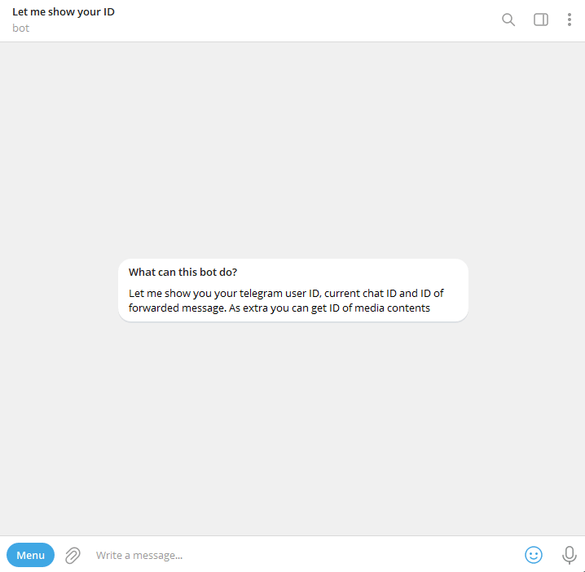

<div align="center"> 
    <a href="https://t.me/letmeshowidbot">
        
    </a>
</div>

# Telegram bot to show user's/chat's unique ID in Telegram

[**Demo in Telegram**](https://t.me/letmeshowidbot)

**Telegram bot to show some IDs, like:**

* Your user ID (in private chat with any message or /id command);
* Group/supergroup ID (when bot added to that group with /id command);
* Channel ID (when message forwarded from channel);
* Supergroup ID (when message forwarded from group);
* Animation/Audio/Document/Photo/Sticker/Video/Voice IDs
* Inline mode in any chat


## Installation

1. #### Clone the repository:

   * `git clone https://github.com/rkjar/let_me_show_id_bot`
2. #### Install requirements

   * `pip install -r requirements.txt` OR`poetry install`
3. #### Change the configuration:

   * Copy `env_example` and `config_example.py`
   * Rename it to `.env` and `config.py`
   * Insert your values
4. #### Run bot:

   * `python main.py`


## Commands

```
/start          Start the bot
/id             Let me show you id
/help           Help
/admin          Admin menu (available for admins only)
```

## Usage

<div align="center">



</div>
